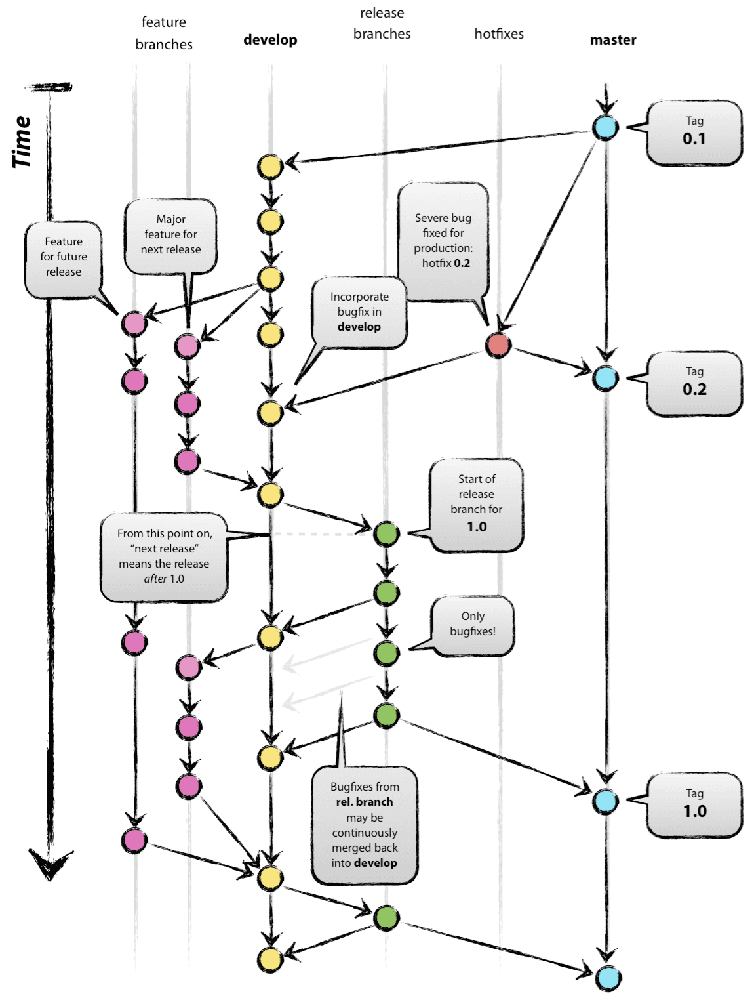

# Gitflow Branching Model :construction:

Our git workflow of [choice :construction:](https://github.com/snowplow-incubator/engineering-resources/issues/8) is Gitflow - a well-established release-based git branching model allowing for organized cooperation.
Currently the model is used in [beam-enrich][beam-enrich] and shortly in `scala-common-enrich` as an initial experiment before rolling out to other repositories.

Gitflow is best introduced with a diagram further described in [original introduction][intro].

To summarise:
- `master` - a permanent branch that's locked and serves as reference point
- `develop` - a permanent used to integrate new features - PRs get into develop by default
- `feature/....` - short-lived branches introducing complete features; spun-off develop and to integrated into develop
- `hotfix/...` - short-lived branches spun off master to fix the current production version
- `release/...` -  short-lived, spun off develop to kickstart release process; integrated into master

For further details see resources [resources](#resources)

## Series branches

Additionally, for long-term support we use dedicated `series/x.x` branches that can be spun off already released versions when major or minor has already advanced.
For example [`beam-enrich`][beam-enrich] version `1.0.0` has been released but due to critical error uncovered in `0.4.0` some changes have to be introduced to the version along with additional backports. This can be done easily by spawning a dedicated `series/0.4` branch and allowing `master` to advance further without rewrites while maintaining flexibility on further changes to `0.4.x`-series.

## Resources

- [Original introduction][intro]
- [Gitflow Workflow by Atlassian](https://www.atlassian.com/git/tutorials/comparing-workflows/gitflow-workflow)
- [CLI integration](https://github.com/petervanderdoes/gitflow-avh)

[intro]: https://nvie.com/posts/a-successful-git-branching-model/
[beam-enrich]: https://github.com/snowplow/beam-enrich
